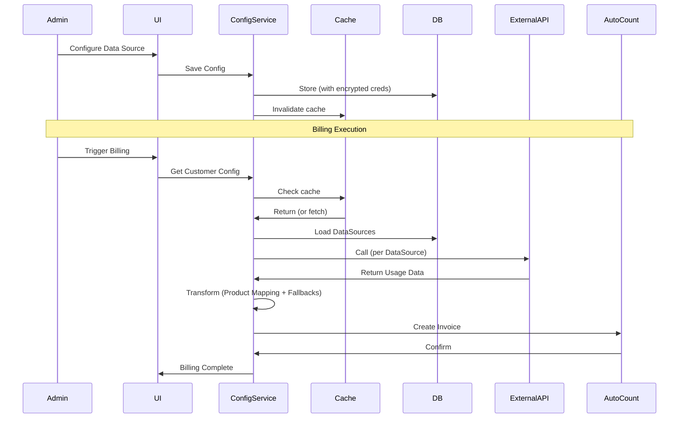

# Dynamic Customers - Configuration-as-a-Service (CaaS) Design

**Date:** 2026-03-17
**Status:** Draft (updated 2026-03-25)
**Author:** Claude

---

## 1. Executive Summary

Transform the billing application from a static, hardcoded system into a dynamic **Configuration-as-a-Service (CaaS)** platform. This enables non-developer admins to onboard new customers and configure their unique external data sources and AutoCount ERP settings entirely through a UI, with zero hardcoding.

**Scope:** Complete CaaS with all 4 requirements (Dynamic Endpoints, AutoCount Integration, Product Mapping, Status-based Billing)

**Timeline:** 2-4 weeks (rapid delivery)

**Scale:** <50 customers (small scale)

---

## 1.1 Constraints - BACKWARD COMPATIBILITY (CRITICAL)

This implementation **MUST NOT** impact existing functionality. The following constraints apply:

| Constraint | Description |
|------------|-------------|
| **No Breaking Changes** | All existing API endpoints must maintain backward-compatible responses |
| **Coway (Malaysia) Unaffected** | The existing Coway billing must continue to work exactly as before |
| **Legacy Billing Fallback** | Existing customers without data sources must continue using legacy billing |
| **AutoCount Integration** | Current AutoCount invoice creation must remain functional |
| **No Data Loss** | All existing customer data must be preserved during migration |
| **Feature Flag Support** | New dynamic features must be toggleable to allow rollback |

### Existing Functionality to Preserve

The following are already working and MUST NOT be broken:

1. **Coway Billing Service** - `cowayBillingService.ts` handles SMS/WhatsApp/Email billing
2. **AutoCount Invoice Creation** - `autocountClient.ts` creates invoices with retry logic
3. **Customer Wizard** - Existing wizard at `/admin/customers/wizard` must continue working
4. **DataSource CRUD** - Existing API routes at `/api/customers/[id]/datasources`
5. **Product Mappings** - Existing AutoCount product mapping at `/api/autocount/product-mappings`
6. **Billing Schedule** - Existing cron-based billing execution

### Implementation Strategy

- **Add new fields** rather than modifying existing field structures
- **Feature flag** new dynamic billing logic behind `DYNAMIC_BILLING_ENABLED` env var
- **Parallel execution** - Run both legacy and dynamic billing during transition
- **Gradual rollout** - Enable per-customer once validated

---

## 1.2 What Already Exists (vs What Needs to Be Added)

| Feature | Already Exists | Needs to Add |
|---------|----------------|--------------|
| DataSource model with types (COWAY_API, RECON_SERVER, CUSTOM_REST_API) | ✅ Yes | - |
| Customer.dataSources array | ✅ Yes | - |
| Customer.autocountAccountBookId | ✅ Yes | - |
| Customer.autocountDebtorCode | ✅ Yes | - |
| Customer.billingMode (MANUAL/AUTO_PILOT) | ✅ Yes | - |
| Customer.schedule | ✅ Yes | - |
| ServiceProductMappings | ✅ Yes | - |
| DataSource.authCredentials | ✅ Yes | - |
| DataSource.responseMapping | ✅ Yes | - |
| **Customer.status** | ❌ No | Add `Customer.status` |
| **Customer.billingCycle** | ❌ No | Add `Customer.billingCycle` |
| **Customer.defaultFields** | ❌ No | Add `Customer.defaultFields` |
| **DataSource.fallbackValues** | ❌ No | Add `DataSource.fallbackValues` |
| **DataSource.retryPolicy** | ❌ No | Add `DataSource.retryPolicy` |
| **DataSource.lineItemMappings** | ❌ No | Add multi-line response support |
| **DataSource.requestTemplate** | ❌ No | Add POST + template injection |
| **CustomerProductMappings** | ❌ No | New collection — per-customer per-line product config |
| **AutoCountAccountBook new fields** | ❌ No | Add `defaultSalesAgent`, `defaultAccNo`, `defaultClassificationCode`, `inclusiveTax`, `submitEInvoice` |
| **Credential Encryption** | ❌ No | Add AES-256 encryption for `authCredentials` |
| **ConfigCache** | ❌ No | Add in-memory config cache |

---

## 2. Architecture Overview

### 2.1 Design Principle

**Evolve Existing** - Extend the existing `DataSource`, `AutoCountAccountBook`, and `ServiceProductMapping` models rather than creating new abstractions. This minimizes impact and delivers fastest.

### 2.2 High-Level Architecture

```
┌─────────────────────────────────────────────────────────────────────────┐
│                        Admin Configuration Panel                        │
│                    (Next.js - extends existing wizard)                  │
└─────────────────────────────────────────────────────────────────────────┘
                                    │
                                    ▼
┌─────────────────────────────────────────────────────────────────────────┐
│                     Configuration Service Layer                         │
│  ┌─────────────────┐  ┌─────────────────┐  ┌─────────────────────────┐ │
│  │ ConfigLoader    │  │ CredentialCrypto│  │ ProductTranslationTable │ │
│  │ (Cache + Load)  │  │ (Secure Store)  │  │ (Mapping + Fallbacks)   │ │
│  └─────────────────┘  └─────────────────┘  └─────────────────────────┘ │
└─────────────────────────────────────────────────────────────────────────┘
                                    │
                                    ▼
┌─────────────────────────────────────────────────────────────────────────┐
│                       Billing Engine (Enhanced)                         │
│  ┌─────────────────┐  ┌─────────────────┐  ┌─────────────────────────┐ │
│  │ DataSourceClient│  │ DataTransformer │  │ AutoCountPublisher      │ │
│  │ (Dynamic APIs)   │  │ (Map + Fallback)│  │ (Per AccountBook)        │ │
│  └─────────────────┘  └─────────────────┘  └─────────────────────────┘ │
└─────────────────────────────────────────────────────────────────────────┘
```

---

## 3. Database Schema

### 3.1 Design Principle

**Evolve Existing + Add New Only When Necessary**

- Extend existing models with new fields (backward compatible)
- Create new collections only when existing schemas cannot accommodate the data
- **Backward compatibility is mandatory** — existing data sources with single `responseMapping` must continue to work

### 3.2 AutoCount Account Books — Enhanced Schema

> **Collection:** `autocountAccountBooks`
> **Change:** Add 5 new fields. Existing fields remain unchanged.

```typescript
interface AutoCountAccountBook {
  // === EXISTING FIELDS ===
  id: string;
  name: string;
  accountBookId: string;
  keyId: string;
  apiKey: string;
  defaultCreditTerm: string;
  defaultSalesLocation: string;
  defaultTaxCode?: string;
  taxEntity?: string;
  invoiceDescriptionTemplate?: string;
  furtherDescriptionTemplate?: string;
  createdAt: string;
  updatedAt: string;

  // === NEW FIELDS ===
  /** Default sales agent assigned to invoices generated from this account book */
  defaultSalesAgent: string;           // e.g., "Olivia Yap"

  /** Default GL account code for line items if not overridden per mapping */
  defaultAccNo: string;               // e.g., "500-0000"

  /** Default product classification code for line items */
  defaultClassificationCode: string;  // e.g., "022"

  /** Whether invoices are tax-inclusive (globally for this account book) */
  inclusiveTax: boolean;             // e.g., false

  /** Whether to submit e-invoice for transactions from this account book */
  submitEInvoice: boolean;           // e.g., false
}
```

### 3.3 Data Sources — Multi-Line Enhanced Schema

> **Collection:** `dataSources`
> **Change:** Add `lineItemMappings[]`, `requestTemplate`, `retryPolicy`, `fallbackValues`. Existing single `responseMapping` preserved for backward compatibility.

**Backward compatibility rule:** If `lineItemMappings` is present → use it. Otherwise fall back to `responseMapping` for existing data sources.

```typescript
interface DataSource {
  // === EXISTING FIELDS ===
  id?: string;
  customerId: string;
  type: 'COWAY_API' | 'RECON_SERVER' | 'CUSTOM_REST_API';
  serviceType: 'SMS' | 'EMAIL' | 'WHATSAPP';
  name: string;
  apiEndpoint: string;
  authType: 'API_KEY' | 'BEARER_TOKEN' | 'BASIC_AUTH' | 'NONE';
  authCredentials?: {
    key?: string;        // API key / token value
    token?: string;     // Bearer token value
    username?: string;   // Basic auth username
    password?: string;   // Basic auth password
    headerName?: string; // Custom header name (e.g., "x-token")
  };
  isActive: boolean;
  createdAt?: Date;
  updatedAt?: Date;

  // === LEGACY (backward compat) — used when lineItemMappings is absent ===
  responseMapping?: {
    usageCountPath: string;
    sentPath?: string;
    failedPath?: string;
  };

  // === NEW FIELDS ===

  /**
   * Multi-line item support.
   * When present, this takes precedence over responseMapping.
   * Each entry maps one sub-line from the API response to a billable line item.
   */
  lineItemMappings?: Array<{
    /** Identifier for this line — must match a CustomerProductMapping.lineIdentifier */
    lineIdentifier: string;   // e.g., "SMS-DOMESTIC", "SMS-INTL", "EMAIL", "WHATSAPP"

    /** JSON path within the API response to extract the usage count */
    countPath: string;        // e.g., "data[0].line_items[0].qty" or "count"

    /** Optional: JSON path to a rate embedded in the API response.
     *  If set AND the value exists → use API rate.
     *  If absent or value is null → fall back to fallbackRate. */
    ratePath?: string;        // e.g., "data[0].line_items[0].unitprice"

    /** Fixed fallback rate used when ratePath is absent, null, or 0.
     *  If also absent → resolve from CustomerProductMapping.defaultUnitPrice. */
    fallbackRate?: number;   // e.g., 0.079
  }>;

  /** Request template for dynamic endpoint calls.
   *  Supports both GET and POST with parameter injection. */
  requestTemplate?: {
    /** HTTP method */
    method: 'GET' | 'POST';

    /** Optional fixed headers (beyond auth header) */
    headers?: Record<string, string>;

    /** Optional body template for POST requests.
     *  Supports template tokens: {billingMonth}, {month}, {year}
     *  Example: '{"month": "{month}", "year": "{year}"}' */
    bodyTemplate?: string;
  };

  /** Retry and timeout policy for external API calls */
  retryPolicy?: {
    maxRetries: number;          // e.g., 3
    retryDelaySeconds: number;   // e.g., 30
    timeoutSeconds: number;     // e.g., 60
  };

  /** Fallback values used when the external API fails or returns no data */
  fallbackValues?: {
    usageCount?: number;       // Default count when API fails
    sentCount?: number;        // Default sent count
    failedCount?: number;      // Default failed count
    useDefaultOnMissing: boolean; // If true, use fallback when data is absent
  };
}
```

#### 3.3.1 Request Parameter Template Tokens

The following tokens are available for use in URL query strings and POST body templates:

| Token | Resolved Value | Example |
|-------|---------------|---------|
| `{billingMonth}` | Billing period as YYYY-MM | `"2026-03"` |
| `{month}` | Month number (1-12) | `"3"` |
| `{year}` | Full year | `"2026"` |

**For GET requests:** Tokens are substituted into the URL query string.
Example: `?period={billingMonth}` → `?period=2026-03`

**For POST requests:** Tokens are substituted into `bodyTemplate`.
Example: `{"month": "{month}", "year": "{year}"}` → `{"month": "3", "year": "2026"}`

#### 3.3.2 Custom Header Authentication

For APIs that use non-standard auth headers (e.g., `x-token`), set `headerName` alongside `key`:

```typescript
authCredentials: {
  key: "fGxqeS9pzR7duRBV7xpXSkFBPtQFKn",
  headerName: "x-token"  // Sends: x-token: fGxqeS9pzR7duRBV7xpXSkFBPtQFKn
}
```

### 3.4 Customer Product Mappings — New Collection

> **Collection:** `customerProductMappings`
> **Purpose:** Per-customer, per-service, per-line-identifier AutoCount product configuration.
> **Key:** `(customerId, serviceType, lineIdentifier)` is unique.

This is the **single source of truth** for all per-line AutoCount detail fields. It is keyed per customer (not per account book), enabling each customer to have their own product configuration even when sharing an account book.

```typescript
interface CustomerProductMapping {
  id: string;                              // e.g., "cpm-coway-sms-domestic"
  customerId: string;                      // Links to customers collection
  serviceType: 'SMS' | 'EMAIL' | 'WHATSAPP';
  /** Identifies the sub-line — must match a DataSource.lineItemMappings.lineIdentifier */
  lineIdentifier: string;                  // e.g., "DOMESTIC", "INTL", "WHATSAPP"

  // === PER-LINE AUTOCOUNT DETAIL FIELDS ===

  /** AutoCount product code for this line */
  productCode: string;                     // e.g., "SMS-Enhanced", "Email-Blast"

  /** Short description shown as line item description in AutoCount */
  description: string;                      // e.g., "SMS Blast ECS"

  /** Full billing description template. Supports placeholders:
   *  {BillingCycle}, {CustomerName}, {TotalAmount},
   *  {SMSCount}, {SMSRate}, {SMSTotal},
   *  {EmailCount}, {EmailRate}, {EmailTotal},
   *  {WhatsAppCount}, {WhatsAppRate}, {WhatsAppTotal} */
  furtherDescriptionTemplate: string;       // e.g., "For {BillingCycle}, the total number of SMS messages sent..."

  /** Product classification code for this line (overrides accountBook.defaultClassificationCode) */
  classificationCode: string;               // e.g., "022"

  /** Unit label for the quantity (overrides accountBook default) */
  unit: string;                            // e.g., "messages"

  /** GL account code for this line (overrides accountBook.defaultAccNo) */
  accNo?: string;                         // e.g., "500-0000" (optional — if absent, use accountBook default)

  /** GST tax code for this line (overrides accountBook.defaultTaxCode) */
  taxCode: string;                         // e.g., "SV-6", "SR"

  /** Billing mode for quantity and unit price */
  billingMode: 'ITEMIZED' | 'LUMP_SUM';  // ITEMIZED: qty=count, unitPrice=rate. LUMP_SUM: qty=1, unitPrice=total

  /** Default unit price / rate — used when DataSource has no fallbackRate */
  defaultUnitPrice: number;                // e.g., 0.079

  createdAt: string;
  updatedAt: string;
}
```

### 3.5 AutoCount Invoice Field Coverage

Every field in the AutoCount Invoice API has a defined configuration source. No field should be hardcoded.

#### 3.5.1 MASTER Section (Invoice Header — one per invoice)

| # | AutoCount Field | Config Source | Resolution Order | UI Location |
|---|-----------------|---------------|-----------------|-----------|
| 1 | `docNo` | AutoCount API | Auto-generate | — |
| 2 | `docDate` | System | `new Date().toISOString().split('T')[0]` (today) | Not configurable |
| 3 | `taxDate` | System | `new Date().toISOString().split('T')[0]` (today) | Not configurable |
| 4 | `debtorCode` | `customers.autocountDebtorCode` | Direct from customer | Wizard Step 3 |
| 5 | `debtorName` | `customers.name` | Direct from customer | Wizard Step 1 |
| 6 | `creditTerm` | Override → account book | `customers.creditTermOverride` → `autoCountAccountBooks.defaultCreditTerm` | Wizard Step 3 + `/autocount-settings` |
| 7 | `salesLocation` | Override → account book | `customers.salesLocationOverride` → `autoCountAccountBooks.defaultSalesLocation` | Wizard Step 3 + `/autocount-settings` |
| 8 | `salesAgent` | Account book | `autoCountAccountBooks.defaultSalesAgent` | `/autocount-settings` |
| 9 | `address` | `billingClients.address` | Lookup by `debtorCode` | `/admin/billing-clients` |
| 10 | `taxEntity` | Account book → billing client | `autoCountAccountBooks.taxEntity` → `billingClients.tax_entity` | `/autocount-settings` + billing clients |
| 11 | `description` | Template resolver | `customers.invoiceDescriptionTemplate` → `autoCountAccountBooks.invoiceDescriptionTemplate` → hardcoded | `/autocount-settings` |
| 12 | `inclusiveTax` | Account book | `autoCountAccountBooks.inclusiveTax` | `/autocount-settings` |
| 13 | `submitEInvoice` | Account book | `autoCountAccountBooks.submitEInvoice` | `/autocount-settings` |
| 14 | `currencyRate` | Fixed | `1` | Not configurable |
| 15 | `isRoundAdj` | Fixed | `false` | Not configurable |
| 16 | `toBankRate` | Fixed | `1` | Not configurable |
| 17 | `paymentAmt` | Fixed | `0` | Not configurable |
| 18–24 | `email`, `ref`, `note`, `remark1–4` | Fixed | `null` | Not configurable |

#### 3.5.2 DETAIL Section (One row per `lineItemMappings` entry)

Populated from `DataSource.lineItemMappings[]` resolved against `CustomerProductMapping[]`.

| # | AutoCount Field | Config Source | Resolution Order | UI Location |
|---|-----------------|---------------|-----------------|-----------|
| 1 | `productCode` | Customer product mapping | `CustomerProductMapping.productCode` | Wizard Step 4 |
| 2 | `accNo` | Mapping → account book | `CustomerProductMapping.accNo` → `autoCountAccountBooks.defaultAccNo` | Wizard Step 4 + `/autocount-settings` |
| 3 | `description` | Customer product mapping | `CustomerProductMapping.description` | Wizard Step 4 |
| 4 | `furtherDescription` | Template resolver | `CustomerProductMapping.furtherDescriptionTemplate` → accountBook → hardcoded | Wizard Step 4 |
| 5 | `qty` | External API response | Via `DataSource.lineItemMappings[].countPath` JSON extraction | Wizard Step 2 |
| 6 | `unit` | Customer product mapping | `CustomerProductMapping.unit` | Wizard Step 4 |
| 7 | `unitPrice` | Rate resolution chain | See Section 3.5.3 | Wizard Step 4 + Step 2 |
| 8 | `localTotalCost` | AutoCount AutoFill | Calculated by AutoCount (qty × unitPrice) | Not configurable |
| 9 | `classificationCode` | Mapping → account book | `CustomerProductMapping.classificationCode` → `autoCountAccountBooks.defaultClassificationCode` | Wizard Step 4 + `/autocount-settings` |
| 10 | `taxCode` | Mapping → account book | `CustomerProductMapping.taxCode` → `autoCountAccountBooks.defaultTaxCode` → `billingClients.tax_code` | Wizard Step 4 |
| 11 | `discount` | Fixed | `null` | Not configurable |
| 12 | `taxAdjustment` | Fixed | `0` | Not configurable |
| 13 | `localTaxAdjustment` | Fixed | `0` | Not configurable |
| 14 | `tariffCode` | Fixed | `null` | Not configurable |

#### 3.5.3 Rate Resolution Chain

The rate for `unitPrice` is resolved from multiple sources, in priority order:

```
1. DataSource.lineItemMappings[].ratePath
   → Extract from API response at specified JSON path
   → Use if value exists and is non-zero
          ↓ (if ratePath absent or value null/zero)
2. DataSource.lineItemMappings[].fallbackRate
   → Use if defined
          ↓ (if fallbackRate also absent)
3. CustomerProductMapping.defaultUnitPrice
   → Use if defined
          ↓ (if also absent)
4. ERROR — rate cannot be resolved
```

This chain supports all three data source patterns:

| Data Source | Pattern | Resolution |
|-------------|---------|-----------|
| `partner-billing-inglab.hypedmind.ai` (INGLAB) | Rate in API | → Step 1 via `ratePath` |
| `sms2.g-i.com.my` (Coway SMS) | Rate NOT in API | → Step 2 via `fallbackRate` |
| `128.199.165.110:8080` (Email) | Rate NOT in API, single line | → Step 2 via `fallbackRate` |
| WhatsApp/Hypedmind | Rate in API | → Step 1 via `ratePath` |

### 3.6 Customers — Enhanced Schema

> **Collection:** `customers`
> **Change:** Add new fields only. Existing fields remain unchanged.

```typescript
interface Customer {
  // ... existing fields ...

  // === EXISTING (already in model, referenced here for completeness) ===
  autocountAccountBookId?: string;
  autocountDebtorCode?: string;
  creditTermOverride?: string;
  salesLocationOverride?: string;
  invoiceDescriptionTemplate?: string;
  furtherDescriptionTemplate?: string;
  serviceProductOverrides?: Array<{
    serviceType: 'SMS' | 'EMAIL' | 'WHATSAPP';
    productCode: string;
    billingMode?: 'ITEMIZED' | 'LUMP_SUM';
  }>;

  // === NEW FIELDS ===
  status: 'ACTIVE' | 'SUSPENDED' | 'MAINTENANCE';
  billingCycle: 'MONTHLY' | 'QUARTERLY' | 'YEARLY';

  defaultFields?: {
    creditTerm?: string;
    salesLocation?: string;
    taxCode?: string;
    description?: string;
  };

  schedule?: {
    dayOfMonth: number;
    time: string;        // "HH:mm"
    timezone: string;
    retryPolicy: {
      maxRetries: number;
      retryDelayMinutes: number;
    };
  };
}
```

### 3.7 Existing Collections — No Changes Needed

The following collections require **no schema changes** but are referenced by the new design:

| Collection | Role in New Design |
|-----------|-------------------|
| `billingClients` | Source for `address`, `tax_entity`, `tax_code` per debtor code |
| `invoices` / `invoiceHistory` | AutoCount invoice reference storage (existing fields sufficient) |

### 3.8 Credential Encryption

> Credential encryption applies to **all authCredentials fields** across data sources.
> **Approach:** AES-256 encryption in-place on the existing `DataSource.authCredentials` field.
> **Key source:** Environment variable `CREDENTIAL_ENCRYPTION_KEY`.
> **No new collection needed.**

Encrypted fields are never exposed in API responses or logs (masked in UI as `****1234`).

---

## 4. Logic Flow

### 4.1 Billing Request Flow

```
┌──────────────┐
│   Trigger    │
│ (Schedule/   │
│  Manual)     │
└──────┬───────┘
       │
       ▼
┌──────────────────────────────────────────────────────────────────┐
│                    Configuration Service                          │
│  ┌────────────────┐                                             │
│  │ ConfigLoader   │ ──▶ Load Customer Config (with cache)       │
│  │ (Cache Layer)  │ ──▶ Check customer status (ACTIVE?)          │
│  └────────────────┘                                             │
└──────────────────────────────────────────────────────────────────┘
                              │
                              ▼
┌──────────────────────────────────────────────────────────────────┐
│                      Data Source Layer                            │
│  ┌────────────────┐    ┌────────────────┐    ┌────────────────┐ │
│  │ Get Active     │───▶│ Call External │───▶│ Handle Errors  │ │
│  │ DataSources    │    │ API (Dynamic) │    │ (Retry/Fallback)│
│  └────────────────┘    └────────────────┘    └────────────────┘ │
└──────────────────────────────────────────────────────────────────┘
                              │
                              ▼
┌──────────────────────────────────────────────────────────────────┐
│               Multi-Line Extraction Layer                          │
│  ┌────────────────┐    ┌────────────────┐                      │
│  │ For each       │───▶│ Extract count  │                      │
│  │ lineItemMapping│    │ via countPath  │                      │
│  └────────────────┘    └────────────────┘                      │
│           │                                                     │
│           ▼                                                     │
│  ┌──────────────────────────────────────────────────────────┐   │
│  │ Rate Resolution Chain (Section 3.5.3)                      │   │
│  │  ratePath → fallbackRate → customerProductMappings        │   │
│  └──────────────────────────────────────────────────────────┘   │
└──────────────────────────────────────────────────────────────────┘
                              │
                              ▼
┌──────────────────────────────────────────────────────────────────┐
│               CustomerProductMappings Resolution                    │
│  ┌────────────────┐    ┌────────────────┐    ┌────────────────┐ │
│  │ Match by       │───▶│ Resolve all   │───▶│ Validate       │ │
│  │ lineIdentifier │    │ per-line      │    │ Required Fields│ │
│  │               │    │ fields        │    │               │ │
│  └────────────────┘    └────────────────┘    └────────────────┘ │
│       │                                                        │
│       │  (accNo, classificationCode, taxCode,                  │
│       │   furtherDescriptionTemplate, billingMode)             │
└──────────────────────────────────────────────────────────────────┘
                              │
                              ▼
┌──────────────────────────────────────────────────────────────────┐
│                   AutoCount Publishing                            │
│  ┌────────────────┐    ┌────────────────┐    ┌────────────────┐ │
│  │ Resolve        │───▶│ Build Invoice  │───▶│ Create Invoice │ │
│  │ Master Fields  │    │ Details[]      │    │ (per customer) │ │
│  └────────────────┘    └────────────────┘    └────────────────┘ │
└──────────────────────────────────────────────────────────────────┘
```

### 4.2 Customer Onboarding Flow

```
┌──────────────┐
│  Start       │
│ Wizard       │
└──────┬───────┘
       │
       ▼
┌──────────────────────────────────────────────────────────────────┐
│ Step 1: Basic Info                                               │
│  - Customer Name, Code                                           │
│  - Status (default: ACTIVE)                                       │
│  - Billing Cycle                                                  │
└──────────────────────────────────────────────────────────────────┘
       │
       ▼
┌──────────────────────────────────────────────────────────────────┐
│ Step 2: Data Sources (per service type)                          │
│  - Add REST API / Recon Server / Coway API                       │
│  - Configure endpoint, auth, response mapping                     │
│  - Set fallback values                                            │
│  - Test connection                                                │
└──────────────────────────────────────────────────────────────────┘
       │
       ▼
┌──────────────────────────────────────────────────────────────────┐
│ Step 3: AutoCount Integration                                    │
│  - Select / Create Account Book                                   │
│  - Map customer to AutoCount Debtor                               │
│  - Set default fields                                             │
└──────────────────────────────────────────────────────────────────┘
       │
       ▼
┌──────────────────────────────────────────────────────────────────┐
│ Step 4: Product Mapping                                          │
│  - Map SMS/Email/WhatsApp to AutoCount products                  │
│  - Set fallback products                                          │
│  - Configure billing mode (itemized/lump sum)                     │
└──────────────────────────────────────────────────────────────────┘
       │
       ▼
┌──────────────────────────────────────────────────────────────────┐
│ Step 5: Schedule                                                 │
│  - Billing day, time                                             │
│  - Retry policy                                                   │
│  - Enable / Test                                                 │
└──────────────────────────────────────────────────────────────────┘
```

---

## 5. Scalability & Performance

### 5.1 Caching Strategy (for <50 customers)

| Component | Strategy | TTL |
|-----------|----------|-----|
| Customer Config | In-memory Map | 5 minutes |
| DataSource List | In-memory Map | 5 minutes |
| Product Mappings | In-memory Map | 10 minutes |
| AccountBook Creds | Encrypted cache | 15 minutes |

### 5.2 Implementation

```typescript
// ConfigCache service
class ConfigCache {
  private cache = new Map<string, { data: any; expiresAt: number }>();

  get<T>(key: string): T | null {
    const entry = this.cache.get(key);
    if (entry && entry.expiresAt > Date.now()) {
      return entry.data;
    }
    this.cache.delete(key);
    return null;
  }

  set(key: string, data: any, ttlMinutes: number = 5): void {
    this.cache.set(key, {
      data,
      expiresAt: Date.now() + ttlMinutes * 60 * 1000,
    });
  }

  invalidate(customerId: string): void {
    // Clear all cache entries for a customer
    this.cache.delete(`customer:${customerId}`);
    this.cache.delete(`datasources:${customerId}`);
    this.cache.delete(`mappings:${customerId}`);
  }
}
```

### 5.3 Background Refresh

```typescript
// Cron job for cache refresh (runs every 5 minutes)
cron.schedule('*/5 * * * *', async () => {
  const customers = await customerRepository.findActive();
  for (const customer of customers) {
    configCache.invalidate(customer.id);
  }
});
```

---

## 6. UI/UX Concept - Admin Configuration Panel

### 6.1 Page Structure

```
┌─────────────────────────────────────────────────────────────────┐
│  Billing Solutions                              [Admin] [Logout] │
├─────────────────────────────────────────────────────────────────┤
│  Dashboard │ Customers │ Billing │ Reports │ Settings          │
├─────────────────────────────────────────────────────────────────┤
│                                                                 │
│  ┌───────────────────────────────────────────────────────────┐  │
│  │ Customer Configuration                                    │  │
│  ├───────────────────────────────────────────────────────────┤  │
│  │ [Select Customer: ▼ Coway (Malaysia) ] [+ New Customer]  │  │
│  ├───────────────────────────────────────────────────────────┤  │
│  │ [Basic Info] [Data Sources] [AutoCount] [Products] [Schedule]│
│  ├───────────────────────────────────────────────────────────┤  │
│  │                                                            │  │
│  │  Content varies by tab...                                  │  │
│  │                                                            │  │
│  └───────────────────────────────────────────────────────────┘  │
│                                                                 │
└─────────────────────────────────────────────────────────────────┘
```

### 6.2 Tab: Data Sources

```
┌─ Data Sources Tab ────────────────────────────────────────────┐
│                                                                │
│  Service: [All ▼]  [+ Add Source]                             │
│                                                                │
│  ┌──────────────────────────────────────────────────────────┐  │
│  │ 📡 SMS - Coway API                           [Edit][Delete]│
│  │    Endpoint: https://sms2.g-i.com.my/api/summaryv2       │  │
│  │    Auth: API_KEY (****1234)                             │  │
│  │    Last Tested: 2026-03-17 09:30 AM ✓                    │  │
│  │    Fallback: usageCount → 0                              │  │
│  └──────────────────────────────────────────────────────────┘  │
│                                                                │
│  ┌──────────────────────────────────────────────────────────┐  │
│  │ 📡 WhatsApp - Recon Server                   [Edit][Delete]│
│  │    Endpoint: https://recon.example.com/whatsapp         │  │
│  │    Auth: BEARER_TOKEN                                   │  │
│  └──────────────────────────────────────────────────────────┘  │
│                                                                │
└────────────────────────────────────────────────────────────────┘
```

### 6.3 Tab: Add/Edit Data Source Modal

```
┌─ Add Data Source ──────────────────────────────────────────────────────┐
│                                                                      │
│  Type:        [CUSTOM_REST_API ▼]                                   │
│  Service:     [SMS ▼]                                                │
│  Name:        [Coway SMS API                                     ]   │
│                                                                      │
│  Endpoint:    [https://sms2.g-i.com.my/api/summaryv2           ]     │
│                                                                      │
│  Auth Type:   [API_KEY ▼]                                            │
│  API Key:     [•••••••••••••••••    ] [Show]                        │
│  Header Name: [x-api-key             ] (optional)                  │
│                                                                      │
│  ── Request Template ─────────────────────────────────────────────    │
│  Method:      [POST ▼]                                               │
│  Body Template: [{"month": "{month}", "year": "{year}"}         ]     │
│                                                                      │
│  ── Line Item Mappings ──────────────────────────────────────────     │
│  [+ Add Line]                                                       │
│  ┌────────────────────────────────────────────────────────────────┐   │
│  │ Line ID    │ Count Path               │ Rate Path  │ Fallback  │   │
│  │ SMS-DOMESTIC│ data[0].line_items[0].qty│ (leave)   │ 0.079    │   │
│  ├────────────┼───────────────────────────┼───────────┼───────────┤   │
│  │ SMS-INTL   │ data[1].line_items[0].qty │ (leave)   │ 0.100    │   │
│  ├────────────┼───────────────────────────┼───────────┼───────────┤   │
│  │ EMAIL      │ data[2].line_items[0].qty │ (leave)   │ 0.11     │   │
│  └────────────────────────────────────────────────────────────────┘   │
│                                                                      │
│  ── Legacy Response Mapping (shown when lineItemMappings is empty)    │
│    Usage Count:  [$.data.usage                                  ]   │
│    Sent Count:   [$.data.sent                                   ]   │
│    Failed Count: [$.data.failed                                  ]   │
│                                                                      │
│  ── Fallback Values ────────────────────────────────────────────      │
│    [✓] Use default when missing                                       │
│    Default Usage: [0]                                                   │
│                                                                      │
│  ── Retry Policy ───────────────────────────────────────────────       │
│    Max Retries:  [3]                                                  │
│    Timeout:      [30] seconds                                         │
│                                                                      │
│        [Test Connection]  [Cancel]  [Save]                           │
│                                                                      │
└──────────────────────────────────────────────────────────────────────┘
```

> **Note:** When `lineItemMappings` has entries, the Legacy Response Mapping section is hidden. When `lineItemMappings` is empty, the Line Item Mappings section is hidden. This ensures backward compatibility with existing single-line data sources.

### 6.4 Tab: AutoCount Integration

```
┌─ AutoCount Tab ────────────────────────────────────────────────────┐
│                                                                    │
│  Account Book: [Select ▼] [+ New Account Book]                     │
│                                                                    │
│  ┌────────────────────────────────────────────────────────────┐   │
│  │ Account Book: Coway Production              [Edit] [Delete] │   │
│  │ Book ID: ACC-2024-001                                       │   │
│  │ Status: ✓ Connected                                         │   │
│  │ Last Sync: 2026-03-17 10:00 AM                            │   │
│  └────────────────────────────────────────────────────────────┘   │
│                                                                    │
│  Customer Mapping:                                                 │
│    AutoCount Debtor Code: [300-C001            ]                  │
│    AutoCount Customer Name: [Coway (Malaysia) Sdn Bhd]          │
│                                                                    │
│  Account Book Defaults (used when customer/mapping has no override):│
│    Credit Term:           [Net 30 days   ]                       │
│    Sales Location:        [HQ            ]                       │
│    Tax Entity:            [TIN:C12113374050                     ]│
│    Default Tax Code:      [SV-6          ]                       │
│    Default GL Acc No:     [500-0000      ]                       │
│    Classification Code:   [022           ]                       │
│    Sales Agent:           [Olivia Yap   ]                       │
│    Inclusive Tax:          [No ▼]                                │
│    Submit E-Invoice:      [No ▼]                                │
│                                                                    │
│        [Test Connection]  [Save]                                 │
│                                                                    │
└────────────────────────────────────────────────────────────────────┘
```

### 6.5 Tab: Product Mapping

> **Key concept:** Mappings are **per-customer, per-service, per-line-identifier**. The `lineIdentifier` (e.g., `SMS-DOMESTIC`, `SMS-INTL`) links a data source's `lineItemMappings[].lineIdentifier` to a specific AutoCount product configuration.

```
┌─ Product Mapping Tab ────────────────────────────────────────────────────────┐
│                                                                             │
│  Customer: [Coway (Malaysia) Sdn Bhd ▼]                                     │
│                                                                             │
│  ┌──────────────────────────────────────────────────────────────────────┐  │
│  │ SMS                                                                     │  │
│  │ [+ Add Line Item]                                                      │  │
│  │ ┌──────────┬─────────────┬──────────────┬───────┬────────┬────────┐ │  │
│  │ │Line ID   │Product Code │ Description  │Tax Code│Unit    │GL AccNo│ │  │
│  │ ├──────────┼─────────────┼──────────────┼────────┼────────┼────────┤ │  │
│  │ │DOMESTIC  │SMS-Enhanced │SMS Blast ECS │ SV-6  │messages│500-0000│ │  │
│  │ │INTL      │SMS-Enhanced │Intl SMS ECS  │ SV-6  │messages│500-0000│ │  │
│  │ └──────────┴─────────────┴──────────────┴───────┴────────┴────────┘ │  │
│  │                                                                        │  │
│  │ Further Description Template:                                          │  │
│  │ [For {BillingCycle}, the total number of SMS sent via ECS...    ]    │  │
│  │                                                                        │  │
│  │ Billing Mode: [LUMP_SUM ▼]  Rate: [0.079]  Class Code: [022]          │  │
│  └──────────────────────────────────────────────────────────────────────┘  │
│                                                                             │
│  ┌──────────────────────────────────────────────────────────────────────┐  │
│  │ WhatsApp                                                                 │  │
│  │ [+ Add Line Item]                                                      │  │
│  │ ┌──────────┬─────────────┬──────────────┬───────┬────────┬────────┐ │  │
│  │ │WHATSAPP  │WA-API       │WhatsApp API  │ SV-6  │messages│500-0000│ │  │
│  │ └──────────┴─────────────┴──────────────┴───────┴────────┴────────┘ │  │
│  │ Further Description Template: [...]  Billing Mode: [LUMP_SUM ▼]       │  │
│  └──────────────────────────────────────────────────────────────────────┘  │
│                                                                             │
│  ┌──────────────────────────────────────────────────────────────────────┐  │
│  │ Email                                                                   │  │
│  │ [+ Add Line Item]                                                      │  │
│  │ ┌──────────┬──────────────┬───────────────┬───────┬────────┬────────┐ │  │
│  │ │EMAIL     │Email-Blast   │Email Blast    │ SV-6  │messages│500-0000│ │  │
│  │ └──────────┴──────────────┴───────────────┴───────┴────────┴────────┘ │  │
│  │ Further Description Template: [...]  Billing Mode: [LUMP_SUM ▼]       │  │
│  └──────────────────────────────────────────────────────────────────────┘  │
│                                                                             │
│        [Save]                                                              │
│                                                                             │
└─────────────────────────────────────────────────────────────────────────────┘
```

**Column descriptions:**

| Column | Description |
|--------|-------------|
| Line ID | Unique identifier matching `DataSource.lineItemMappings[].lineIdentifier` |
| Product Code | AutoCount product code (e.g., `SMS-Enhanced`, `Email-Blast`) |
| Description | Short label for the line item |
| Tax Code | GST tax code (e.g., `SV-6`) |
| Unit | Unit label (e.g., `messages`) |
| GL AccNo | GL account code (overrides account book default if set) |
| Further Description Template | Full billing description with `{BillingCycle}`, `{SMSCount}`, `{SMSRate}`, etc. placeholders |
| Billing Mode | `ITEMIZED` (qty=count, unitPrice=rate) or `LUMP_SUM` (qty=1, unitPrice=total) |
| Rate | Default unit price used when data source has no rate |

### 6.6 Tab: Schedule & Status

```
┌─ Schedule Tab ─────────────────────────────────────────────────┐
│                                                                │
│  Status:  [● ACTIVE ▼]                                        │
│           (ACTIVE | SUSPENDED | MAINTENANCE)                  │
│                                                                │
│  Billing Cycle:  [MONTHLY ▼]                                  │
│                   (Monthly | Quarterly | Yearly)               │
│                                                                │
│  Schedule:                                                     │
│    Day of Month:  [1]                                          │
│    Time:         [02:00] (24-hour format)                      │
│    Timezone:     [Asia/Kuala_Lumpur ▼]                         │
│                                                                │
│  Retry Policy:                                                 │
│    Max Retries:  [3]                                           │
│    Delay:        [60] minutes                                  │
│                                                                │
│  Billing Mode:  [AUTO_PILOT ▼]                                │
│                 (MANUAL | AUTO_PILOT)                          │
│                                                                │
│  Next Billing:  2026-04-01 02:00 AM                          │
│                                                                │
│        [Run Test Billing]  [Save]                              │
│                                                                │
└────────────────────────────────────────────────────────────────┘
```

---

## 7. Reuse and Enhancement Plan

### 7.1 Existing Components to Reuse

| Component | Reuse Strategy |
|-----------|----------------|
| `CustomerRepository` | Add new query methods (`findByStatus`, `findByBillingCycle`) |
| `DataSourceRepository` | Enhance with `lineItemMappings`, `requestTemplate`, `retryPolicy`; backward compat via `responseMapping` |
| `AutoCountClient` | Keep as-is, `accountBookId` already dynamic |
| `CowayClient` | Refactor to use generic `DataSourceClient` |
| `BillingService` | Extend to use `lineItemMappings` and `CustomerProductMappings` |
| `AutoCountInvoiceBuilder` | Extend with new field resolution chain (Section 3.5.2) |
| Customer Wizard (in progress) | Extend Step 2 (Data Sources), Step 4 (Product Mapping) |
| AutoCountSettings page | Extend with new account book fields |

### 7.2 New Components to Create

| Component | Purpose | Collection/Location |
|-----------|---------|-------------------|
| `ConfigurationService` | Central config loader with caching | New service |
| `CredentialEncryptionService` | AES-256 encryption for `authCredentials` | New service |
| `CustomerProductMappingRepository` | CRUD for `customerProductMappings` | New repository |
| `LineItemProcessor` | Multi-line data extraction via `lineItemMappings` | New service |
| `RateResolver` | Rate resolution chain (Section 3.5.3) | New utility |
| `TemplateTokenResolver` | Request param injection ({billingMonth}, {month}, {year}) | New utility |
| `ConfigCache` | In-memory cache layer | New service |

### 7.3 Phased Implementation

**Principle:** Extend existing models, add new fields only. No breaking changes.

| Phase | Duration | Deliverables |
|-------|----------|---------------|
| Phase 1 | Week 1 | Enhanced `autoCountAccountBooks` schema; `/autocount-settings` UI update; backward-compat `AutoCountInvoiceBuilder` |
| Phase 2 | Week 2 | New `customerProductMappings` collection and repository; `CustomerProductMappingRepository`; Wizard Step 4 redesign |
| Phase 3 | Week 3 | `DataSource.lineItemMappings[]` + `requestTemplate`; `LineItemProcessor`; Wizard Step 2 redesign; rate resolution chain |
| Phase 4 | Week 4 | `BillingService` integration with multi-line; `ConfigCache` + `ConfigurationService`; `CredentialEncryptionService` |
| Phase 5 | Week 5 | Status-based billing logic; quarterly/yearly cycle support; parallel testing with Coway |

---

## 8. Security Considerations

### 8.1 Credential Encryption

- **Approach:** Extend existing `DataSource.authCredentials` field with AES-256 encryption
- Encryption key from environment variable `CREDENTIAL_ENCRYPTION_KEY`
- Credentials never logged or exposed in API responses (mask in logs/UI)
- **No new collection needed** - encrypt in-place within existing document

### 8.2 Access Control

- Role-based access (Admin only for configuration)
- Audit log for all configuration changes
- API rate limiting on billing endpoints

---

## 9. Acceptance Criteria

1. **Dynamic Endpoints:** Admin can add/edit/delete data sources via UI without code deployment
2. **AutoCount Mapping:** Each customer can be linked to different AutoCount Account Book
3. **Product Translation:** Source products mapped to AutoCount products with fallback support
4. **Status-based Billing:** Only ACTIVE customers are billed; SUSPENDED customers are skipped
5. **Cycling Support:** MONTHLY, QUARTERLY, YEARLY billing cycles work correctly
6. **Configuration Cache:** Config loads in <100ms for cached data
7. **Fallback Logic:** Missing data uses pre-configured defaults without failing billing
8. **BACKWARD COMPATIBILITY:** Existing Coway billing continues to work exactly as before
9. **No Data Loss:** All existing customer configurations preserved after migration
10. **All AutoCount Fields Configurable:** Every field in the AutoCount Invoice API master and detail sections has a defined config source; no hardcoded values remain except documented fixed values (currencyRate=1, isRoundAdj=false, etc.)
11. **Multi-Line Data Sources:** A single data source API call can produce multiple invoice line items, each with its own product mapping and rate
12. **Hybrid Rate Support:** Both API-embedded rates (via `ratePath`) and configured rates (via `fallbackRate` or `customerProductMappings`) are supported in the same flow
13. **Per-Customer Product Config:** Each customer can define their own AutoCount product configuration per service per line-identifier, independently of other customers sharing the same account book

---

## 10. Risks and Mitigations

| Risk | Impact | Mitigation |
|------|--------|------------|
| **Breaking existing Coway billing** | **CRITICAL - High** | Run both legacy and dynamic billing in parallel; feature flag `DYNAMIC_BILLING_ENABLED`; test with Coway before enabling for new customers |
| **Breaking AutoCount integration** | **CRITICAL - High** | Keep existing `autocountClient.ts` unchanged; only make accountBookId dynamic parameter |
| **Data loss during migration** | High | Full backup before migration; add new fields only (no field removal or modification) |
| Credential security | High | Encryption from day 1; existing authCredentials extended with encryption |
| Cache invalidation | Medium | Manual invalidation endpoint; automatic TTL fallback |
| AutoCount API rate limits | Medium | Implement connection pooling |

---

## Appendix A: API Endpoints

| Endpoint | Method | Purpose |
|----------|--------|---------|
| `/api/config/load` | GET | Load customer config (cached) |
| `/api/config/invalidate` | POST | Invalidate customer cache |
| `/api/datasources` | CRUD | Data source management (existing) - enhanced with encryption |
| `/api/product-mappings` | CRUD | Product translation management (existing) |
| `/api/customers/[id]/status` | GET/PUT | Status management with audit log |
| `/api/customers/[id]/billing-cycle` | GET/PUT | Billing cycle management |

---

## Appendix B: Configuration Flow Sequence


